Homework \#6: Linear Models
================
Pooja Desai (pmd2137)
12/3/2022

## Problem 1

For this problem, we’ll use the 2017 Central Park weather data that
we’ve seen elsewhere. The code chunk below (adapted from the course
website) will download these data.

``` r
weather_df = 
  rnoaa::meteo_pull_monitors(
    c("USW00094728"),
    var = c("PRCP", "TMIN", "TMAX"), 
    date_min = "2017-01-01",
    date_max = "2017-12-31") %>%
  mutate(
    name = recode(id, USW00094728 = "CentralPark_NY"),
    tmin = tmin / 10,
    tmax = tmax / 10) %>%
  select(name, id, everything())
```

    ## Registered S3 method overwritten by 'hoardr':
    ##   method           from
    ##   print.cache_info httr

    ## using cached file: ~/Library/Caches/R/noaa_ghcnd/USW00094728.dly

    ## date created (size, mb): 2022-12-03 13:04:35 (8.428)

    ## file min/max dates: 1869-01-01 / 2022-12-31

The boostrap is helpful when you’d like to perform inference for a
parameter / value / summary that doesn’t have an easy-to-write-down
distribution in the usual repeated sampling framework. We’ll focus on a
simple linear regression with tmax as the response and tmin as the
predictor, and are interested in the distribution of two quantities
estimated from these data:

- r̂ 2
- log(β̂ 0∗β̂ 1)

Use 5000 bootstrap samples and, for each bootstrap sample, produce
estimates of these two quantities.

Plot the distribution of your estimates, and describe these in words.

Using the 5000 bootstrap estimates, identify the 2.5% and 97.5%
quantiles to provide a 95% confidence interval for r̂ 2 and log(β̂ 0∗β̂ 1).

Note: broom::glance() is helpful for extracting r̂ 2 from a fitted
regression, and broom::tidy() (with some additional wrangling) should
help in computing log(β̂ 0∗β̂ 1).

``` r
#Part 1: Plot distribution for R^2 (course provided code)
weather_df %>% 
  modelr::bootstrap(n = 5000) %>% 
  mutate(
    models = map(strap, ~lm(tmax ~ tmin, data = .x) ),
    results = map(models, broom::glance)) %>% 
  select(-strap, -models) %>% 
  unnest(results) %>% 
  ggplot(aes(x = r.squared)) + geom_density()
```


``` r
## Part 2: Plot distribution for log beta (course provided code)
weather_df %>% 
  modelr::bootstrap(n = 5000) %>% 
  mutate(
    models = map(strap, ~lm(tmax ~ tmin, data = .x) ),
    results = map(models, broom::tidy)) %>% 
  select(-strap, -models) %>% 
  unnest(results) %>% 
  select(id = `.id`, term, estimate) %>% 
  pivot_wider(
    names_from = term, 
    values_from = estimate) %>% 
  rename(beta0 = `(Intercept)`, beta1 = tmin) %>% 
  mutate(log_b0b1 = log(beta0 * beta1)) %>% 
  ggplot(aes(x = log_b0b1)) + geom_density()
```


## Problem 2: Homidcide Dataset

The Washington Post has gathered data on homicides in 50 large U.S.
cities and made the data available through GitHub. We completed the
following steps to preprocess the data, similar to previous assignments
using this dataset:

First, we created some new variables:

- `city_state` is variable that joins the city and state fields
  (separated by a comma).

- `solved` is a binary variable that denotes whether or not a case was
  solved.

Second, we update the variables to convert `race` and `sex` are factors.
We also convert `age` to a numeric variable. Third, we filter on the
`race` variable to limit the analysis to victims whose race is
identified as Black or White.

Finally, we removed the following `city_state` values because they were
entry errors or did not report victim race: Dallas, TX; Phoenix, AZ;
Kansas City, MO; Tulsa, AL.

``` r
homicides_df <- read.csv("data/homicide-data.csv")  %>%
  janitor::clean_names() %>%
  mutate(city_state = paste(city,state,sep = ", "),
         solved = ifelse(disposition=="Closed by arrest", 1, 0)) %>%
  
  #convert variables to factors and numeric
  mutate(disposition = as.factor(disposition), 
         victim_race = as.factor(victim_race),
         victim_sex = as.factor(victim_sex),
         victim_age = as.numeric(victim_age)) %>%
  
    #filter by victim race
  filter(victim_race %in% c("Black", "White")) %>%

  #remove erroneous city state
  filter(city_state != "Tulsa, AL", 
         city_state != "Dallas, TX", 
         city_state != "Phoenix, AZ", 
         city_state != "Kansas City, MO") -> cleaned_dataset
```

For the city of Baltimore, MD we used the glm function to fit a logistic
regression with case `solved` as the outcome and `victim age`,
`victim_sex` and `victim_race` as predictors.

From we output we obtained estimates, as use them to calculate the
adjusted odds ratio and 95% confidence interval for each of the
predictors. The results are in the table below.

One question of interest was the adjusted odds ratio for solving
homicides comparing *male victims* to *female victims* keeping all other
variables fixed.

Keeping all other varibales constant, the odds of solving cases with
male victims is 0.60. This means male victims have a reduction of 40% in
the odds of their homicide being solved compared to females.

``` r
#construct glm model
homicide_logistic = 
  cleaned_dataset %>%
  glm(solved ~ victim_age + victim_sex + victim_race, data=., family = binomial())

#obtain estimated from model
homicide_logistic %>%
    broom::tidy() %>% 
    
  #calculate odds
    mutate(OR = exp(estimate), #convert to odds
           CI.lower.95 = exp(estimate-(1.96*std.error)), #lower CI @ 95%
           CI.upper.95 = exp(estimate+(1.96*std.error))) %>% # upper CI @ 95%
    select(term, log_OR = estimate, OR, CI.lower.95, CI.upper.95, p.value) %>%
    filter(term == "victim_sexMale")
```

    ## # A tibble: 1 × 6
    ##   term           log_OR    OR CI.lower.95 CI.upper.95  p.value
    ##   <chr>           <dbl> <dbl>       <dbl>       <dbl>    <dbl>
    ## 1 victim_sexMale -0.506 0.603       0.569       0.639 1.49e-65

Them we ran glm for each of the cities in the dataset, and extract the
adjusted odds ratio (and CI) for solving homicides comparing male
victims to female victims.

``` r
#created function to calculate odds ratio per city
odds_male_solved = function(city) {
subset = cleaned_dataset$city_state==city

#create glm
homicide_logistic = 
  cleaned_dataset[subset,] %>%
  glm(solved ~ victim_age + victim_sex + victim_race, data=., family = binomial())

#obtain estimated from model
homicide_logistic %>%
    broom::tidy() %>% 
    
  #calculate odds
    mutate(OR = exp(estimate), #convert to odds
           CI.lower.95 = exp(estimate-(1.96*std.error)), #lower CI @ 95%
           CI.upper.95 = exp(estimate+(1.96*std.error))) %>% # upper CI @ 95%
  filter(term == "victim_sexMale") %>%
  mutate(city_state = city) %>%
  select(city_state, log_OR = estimate, OR, CI.lower.95, CI.upper.95, p.value) -> values

return(values)}

#test function on example city
odds_male_solved("Baltimore, MD")
```

    ## # A tibble: 1 × 6
    ##   city_state    log_OR    OR CI.lower.95 CI.upper.95  p.value
    ##   <chr>          <dbl> <dbl>       <dbl>       <dbl>    <dbl>
    ## 1 Baltimore, MD -0.854 0.426       0.325       0.558 6.26e-10

Apply function above to all of the cities and states in the dataframe.

``` r
# extract unique list of cities 
city_list <- unique(homicides_df$city_state)

# For cities in dataset, extract odds case solved male
city_odds_male_solved <- purrr::map_df(city_list, odds_male_solved)
```

The graph below shows the odds of solving a homicide case for males
compared to females, keeping all other demographic variables (race, age)
constant in each city.

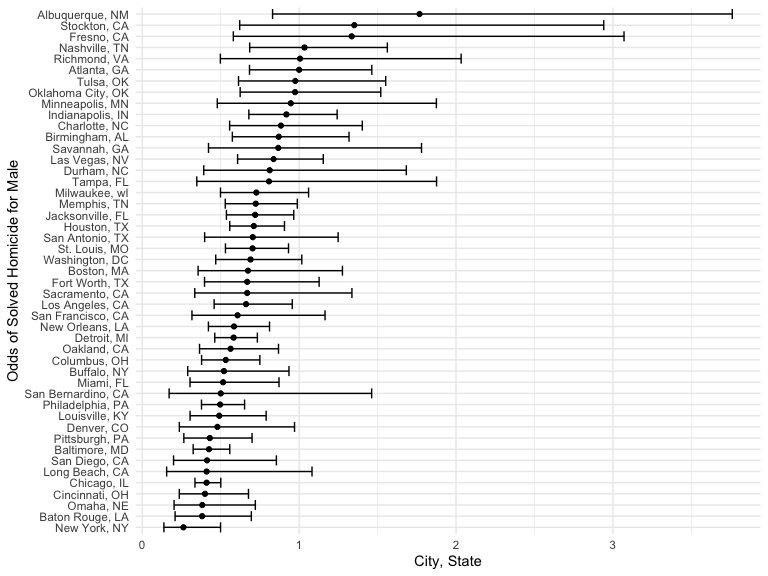
From this graph, we can see that the odds of solving a homicide where
the victim is male is less than 1 in most city, states across the United
States. This means that the odds of solving a homicide case where the
victim is male case is lower than than the odds of solving a homicide
case where the victim is female (all else being equal) in most Cities
with homicides. Some notable exceptions are Nashville, TN; Fresno, CA;
Stockton, CA; and Albuquerque, NM where the odds of solving a homicide
if the vicitim is female is lower than if the victim is male.

## Problem 3: Birthweights

#### Data Cleaning

In this problem, we assess a birthweight dataset to understand factors
that impact a child’s birthweight. This dataset, consists of roughly
4000 children and includes the following variables:

`babysex`: baby’s sex (male = 1, female = 2) `bhead`: baby’s head
circumference at birth (centimeters) `blength`: baby’s length at birth
(centimeteres) `bwt`: baby’s birth weight (grams) `delwt`: mother’s
weight at delivery (pounds) `fincome`: family monthly income (in
hundreds, rounded) `frace`: father’s race (1 = White, 2 = Black, 3 =
Asian, 4 = Puerto Rican, 8 = Other, 9 = Unknown) `gaweeks`: gestational
age in weeks `malform`: presence of malformations that could affect
weight (0 = absent, 1 = present) `menarche`: mother’s age at menarche
(years) `mheigth`: mother’s height (inches) `momage`: mother’s age at
delivery (years) `mrace`: mother’s race (1 = White, 2 = Black, 3 =
Asian, 4 = Puerto Rican, 8 = Other) `parity`: number of live births
prior to this pregnancy `pnumlbw`: previous number of low birth weight
babies `pnumgsa`: number of prior small for gestational age babies
`ppbmi`: mother’s pre-pregnancy BMI `ppwt`: mother’s pre-pregnancy
weight (pounds) `smoken`: average number of cigarettes smoked per day
during pregnancy `wtgain`: mother’s weight gain during pregnancy
(pounds)

Load and clean the data for regression analysis, changes baby sex,
malformations, father race, mother race, and finacial income into
factors. We then checked for missing data. There appear to be no missing
values.

``` r
birthweight <- read.csv("data/birthweight.csv") %>%
  
  #convert categorical variables to factors
  mutate( babysex = as.factor(babysex),
    malform = as.factor(malform),
    frace = as.factor(frace),
    mrace = as.factor(mrace),
    log_inc = log2(fincome))

#Check for missing values
all(!is.na(birthweight))
```

    ## [1] TRUE

#### Generate My Own Birthweight Model

Based on a combination of a hypothesized structure for how factors
interact and a data driven approach I hypothezied the following model:

Birthweight = Gestational Weeks + Baby Length + Pre-Pregnancy BMI +
Maternal Race

To develop this proposed model, I identified variables of interested
based on a hypothesis structure of what variables may impact infant
birth weight after looking through the literature. I identified the
following variables of interest:

1.  `babysex`: baby’s sex (male = 1, female = 2)
2.  `blength`: baby’s length at birth (centimeteres)
3.  `delwt`: mother’s weight at delivery (pounds)
4.  `fincome`: family monthly income (in hundreds, rounded)
5.  `gaweeks`: gestational age in weeks
6.  `mrace`: mother’s race (1 = White, 2 = Black, 3 = Asian, 4 = Puerto
    Rican, 8 = Other)
7.  `ppbmi`: mother’s pre-pregnancy BMI
8.  `smoken`: average number of cigarettes smoked per day during
    pregnancy

Then, I used a data-driven process to understand the relationship in the
data between these variables as predictors for birth weight. The plots
of each of these predictors against birthweight can be seen below.

``` r
a = ggplot(data = birthweight, aes(x = babysex, y = bwt)) + 
    geom_boxplot() #add estimates

b = ggplot(data = birthweight, aes(x = blength, y = bwt)) + 
    geom_point() #add estimates

c = ggplot(data = birthweight, aes(x = delwt, y = bwt)) + 
    geom_point() #add estimates

d = ggplot(data = birthweight, aes(x = log_inc, y = bwt)) + 
    geom_point() #add estimates

e = ggplot(data = birthweight, aes(x = gaweeks, y = bwt)) + 
    geom_point() #add estimates

f = ggplot(data = birthweight, aes(x = mrace, y = bwt)) + 
    geom_boxplot() #add estimates

g = ggplot(data = birthweight, aes(x = ppbmi, y = bwt)) + 
    geom_point() #add estimates

h = ggplot(data = birthweight, aes(x = smoken, y = bwt)) + 
    geom_point() #add estimates

#Generate Plots
library(ggpubr)
ggarrange(a, b, c, d, e, f, g, h + rremove("x.text"), 
          labels = c("A", "B", "C", "D", "E", "F", "G", "H"),
          ncol = 3, nrow = 3)
```

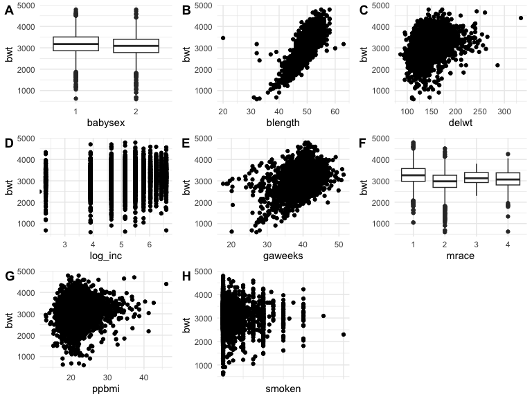

Triangulating this information, I came the following proposed model for
predicting infant birth weight.

Birthweight = Gestational Weeks + Baby Length + Pre-Pregnancy BMI +
Maternal Race

Describe your modeling process and show a plot of model residuals
against fitted values – use add_predictions and add_residuals in making
this plot.

``` r
my_birthweight_model = glm(bwt ~ gaweeks + blength + ppbmi + mrace , data=birthweight)
my_birthweight_model %>% broom::tidy()
```

    ## # A tibble: 7 × 5
    ##   term        estimate std.error statistic   p.value
    ##   <chr>          <dbl>     <dbl>     <dbl>     <dbl>
    ## 1 (Intercept) -4083.      102.      -39.9  2.43e-297
    ## 2 gaweeks        23.8       1.69     14.1  2.58e- 44
    ## 3 blength       124.        1.96     63.1  0        
    ## 4 ppbmi           7.99      1.56      5.11 3.30e-  7
    ## 5 mrace2       -156.       10.5     -14.9  1.06e- 48
    ## 6 mrace3        -71.7      50.2      -1.43 1.53e-  1
    ## 7 mrace4       -105.       22.0      -4.74 2.20e-  6

``` r
#plot(my_birthweight_model) #can also use this to see predicited v. residuals graph
  
birthweight %>% 
  add_predictions(my_birthweight_model) %>%
  add_residuals(my_birthweight_model) %>%
  
  ggplot(aes(x = pred, y = resid)) + 
    geom_point() +
    geom_smooth(se=FALSE,color = "red")
```

    ## `geom_smooth()` using method = 'gam' and formula = 'y ~ s(x, bs = "cs")'

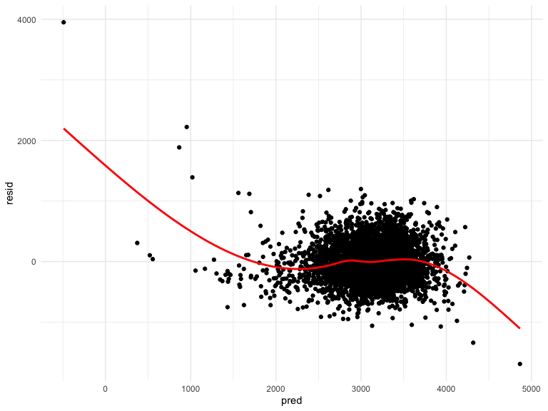

#### Calculate Alternate Birthweight Models

**Model 1**: Predicts birth weight using length at birth and gestational
age as predictors (main effects only). We also used the plot function to
see the Residuals v. Predicted.

``` r
model_1 = glm(bwt ~ blength + gaweeks, data=birthweight)
model_1 %>% broom::tidy()
```

    ## # A tibble: 3 × 5
    ##   term        estimate std.error statistic  p.value
    ##   <chr>          <dbl>     <dbl>     <dbl>    <dbl>
    ## 1 (Intercept)  -4348.      98.0      -44.4 0       
    ## 2 blength        129.       1.99      64.6 0       
    ## 3 gaweeks         27.0      1.72      15.7 2.36e-54

``` r
plot(model_1)
```

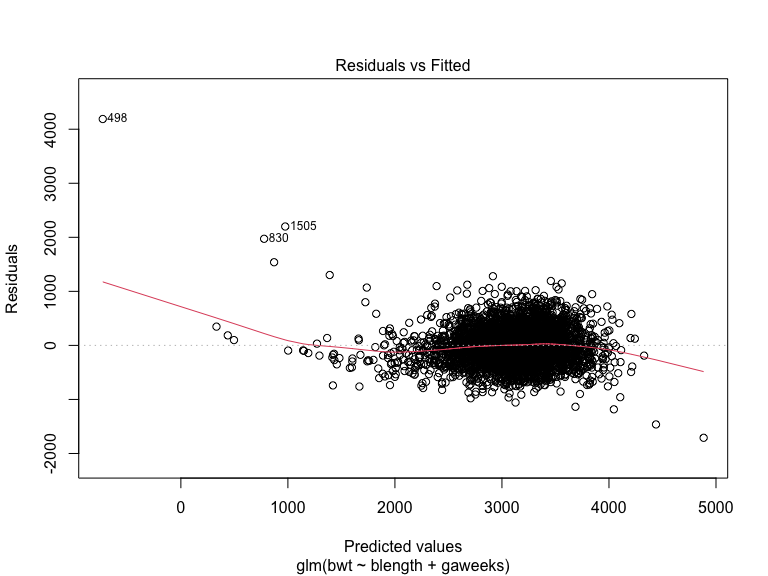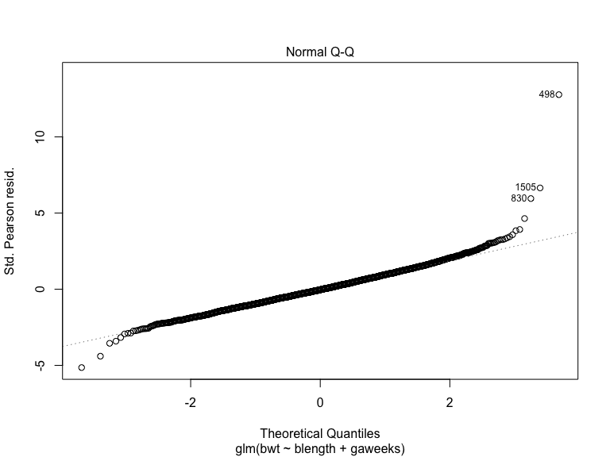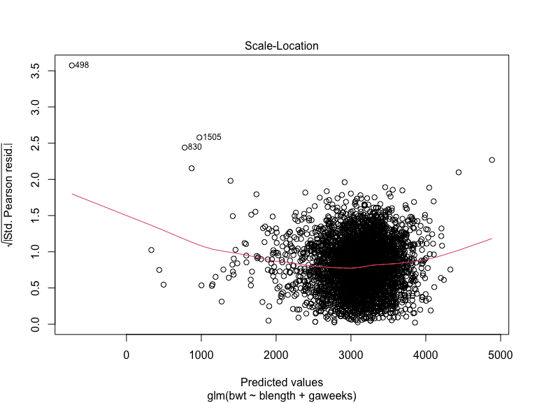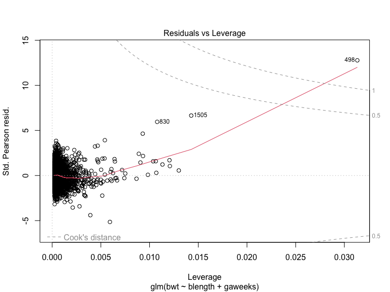

**Model 2**: Predicts birth weight using head circumference, length,
sex, and all interactions (including the three-way interaction) between
these. We also used the plot() function to see the Residuals v.
Predicted.

``` r
model_2 = glm(bwt ~ bhead + blength + babysex + 
                bhead*blength + blength*babysex + bhead*babysex + 
                bhead*blength*babysex, data=birthweight)

model_2 %>% broom::tidy()
```

    ## # A tibble: 8 × 5
    ##   term                    estimate std.error statistic      p.value
    ##   <chr>                      <dbl>     <dbl>     <dbl>        <dbl>
    ## 1 (Intercept)            -7177.     1265.       -5.67  0.0000000149
    ## 2 bhead                    182.       38.1       4.78  0.00000184  
    ## 3 blength                  102.       26.2       3.90  0.0000992   
    ## 4 babysex2                6375.     1678.        3.80  0.000147    
    ## 5 bhead:blength             -0.554     0.780    -0.710 0.478       
    ## 6 blength:babysex2        -124.       35.1      -3.52  0.000429    
    ## 7 bhead:babysex2          -198.       51.1      -3.88  0.000105    
    ## 8 bhead:blength:babysex2     3.88      1.06      3.67  0.000245

``` r
plot(model_2)
```

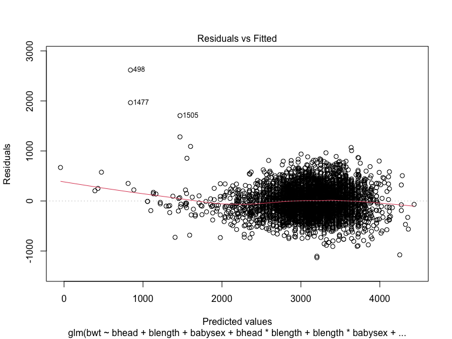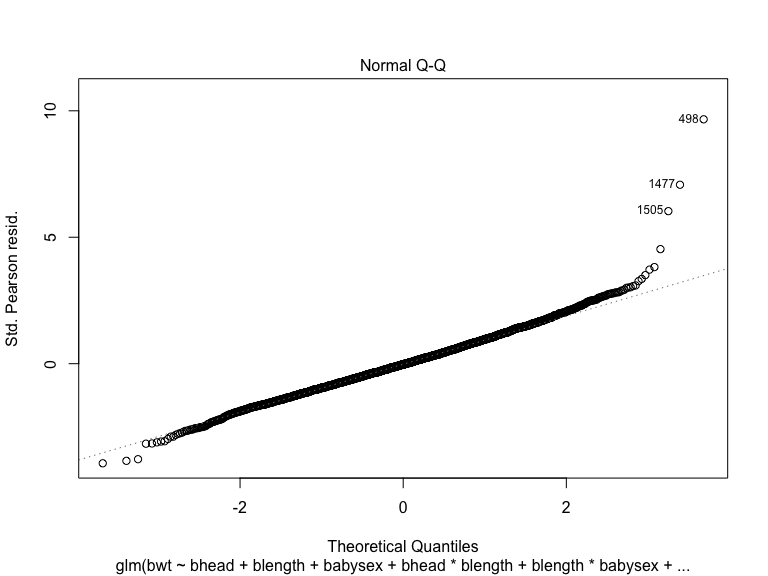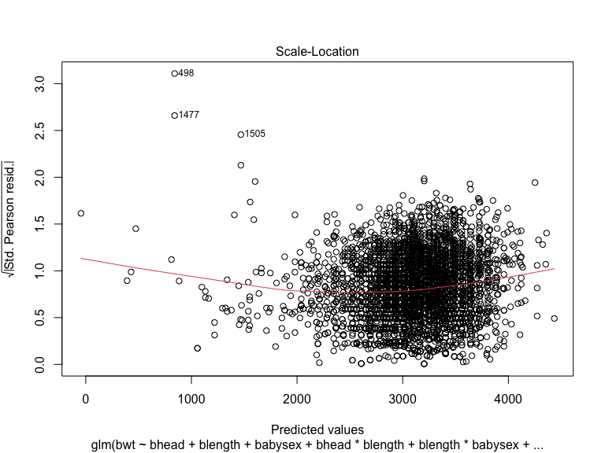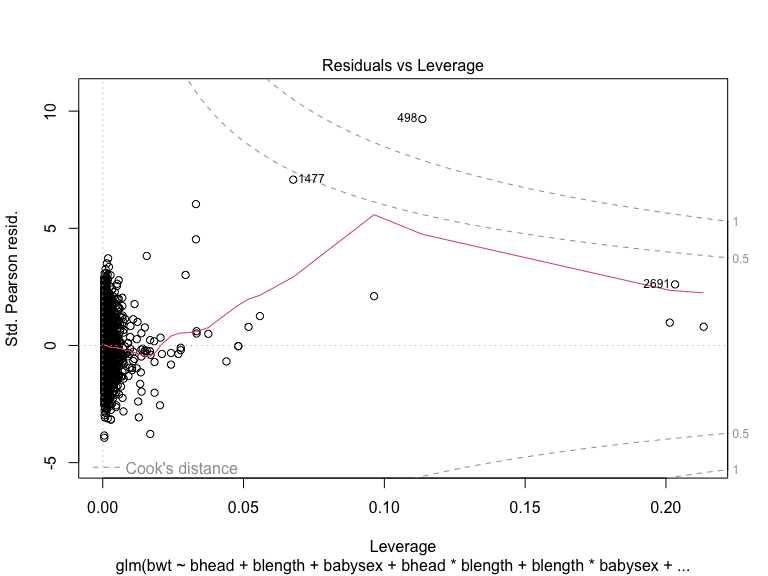

#### Compare Model Performance

Finally to compare the performance of these models we used cross
validation to train models and calculate the prediction error (RMSE) on
test data. We then graphed the RMSE for each model.

This graph allows us to see that Birthweight Model 2 appears to preform
better than Model 1 and my constructed model.

``` r
#Generate CV Test Train Split
cv_data <- crossv_mc(birthweight, 10)

#build models on training data  
my_model = map(cv_data$train, ~my_birthweight_model)
model_1 = map(cv_data$train, ~model_1)
model_2 = map(cv_data$train, ~model_2) 

#calculate prediction error from test data
rmse_my_model = map2_dbl(my_model, cv_data$test, rmse)
rmse_model_1 = map2_dbl(model_1, cv_data$test, rmse)
rmse_model_2 = map2_dbl(model_2 , cv_data$test, rmse) 

rmse_data <-data.frame(rmse_my_model, rmse_model_1, rmse_model_2)
```

``` r
rmse_data %>% 
  select (rmse_my_model, rmse_model_1, rmse_model_2) %>%
  pivot_longer(everything(), names_to = "birthweight_model", values_to = "rmse_value") %>%
  ggplot(aes(x = birthweight_model, y = rmse_value, fill = birthweight_model)) +
  # add violin chart
  geom_boxplot() +
  labs(title = "RMSE Distribution by Birthweight Model", 
       x = "Birthweight Model", 
       y = "RMSE") 
```

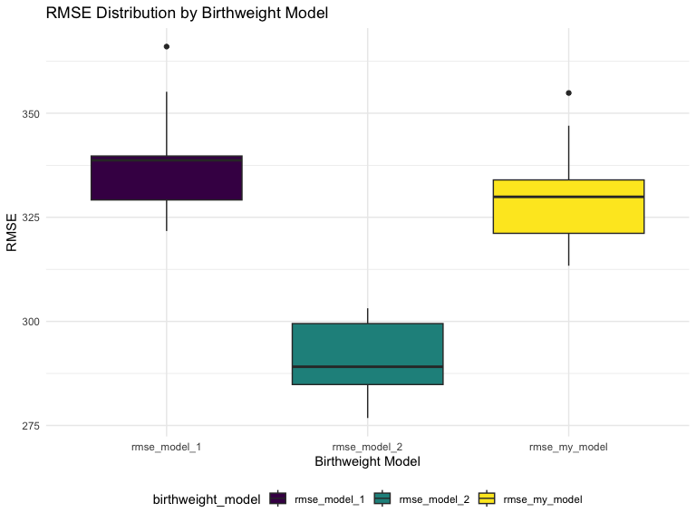
